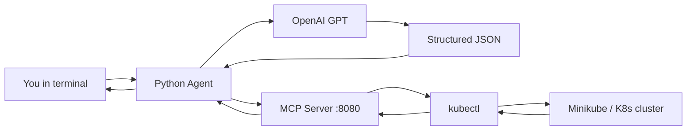

# k8s-agent-mcp

Talk to your Kubernetes cluster in plain English. This project pairs a **natural-language agent** (powered by OpenAI) with an **MCP-style HTTP server** that safely translates structured commands into `kubectl` calls against your cluster (e.g. Minikube).

No need to memorize `kubectl` flags for everyday tasks—describe what you want, and the agent handles the rest.

---

## How it works

The system is a small two-service pipeline: **understand** → **execute** → **return**.



### Step-by-step

| Step | Component | What happens |
|------|-----------|--------------|
| 1 | **Agent** (`agent/`) | You type a natural-language request in the terminal. |
| 2 | **OpenAI** | The agent sends your message to GPT with a fixed prompt template. GPT returns a JSON object with an `instruction` name and `params` (namespace, pod name, etc.). |
| 3 | **Agent** | The agent `POST`s that JSON to the MCP server at `http://localhost:8080/mcp/execute`. |
| 4 | **MCP Server** (`mcp_server/`) | FastAPI receives the request, looks up the instruction in a registry, and builds the matching `kubectl` shell command. |
| 5 | **Cluster** | The server runs the command asynchronously and streams back stdout (or an error if `kubectl` fails). |
| 6 | **Agent** | You see the parsed JSON, the exact `kubectl` command that ran, and the cluster output in your terminal. |

### Design choices

- **Separation of concerns** — The LLM never runs shell commands directly. It only produces structured JSON; the MCP server is the only component that touches `kubectl`.
- **Instruction registry** — New operations are added by defining a prompt function in `mcp_server/src/k8s_mcp_server/prompts.py` and registering it in `server.py`.
- **Session ID** — Every MCP request requires a `session_id` query parameter for traceability (the agent uses a fixed `vscode-session` id by default).

---

## Architecture (ASCII)

```
┌─────────────────────────────────────────────────────────────────┐
│  Terminal / VS Code                                             │
│  "show me all pods in default namespace"                        │
└────────────────────────────┬────────────────────────────────────┘
                             │
                             ▼
┌─────────────────────────────────────────────────────────────────┐
│  Python Agent (agent/agent.py)                                  │
│  • Builds prompt from user message                              │
│  • Calls OpenAI → JSON { instruction, params }                │
│  • POST /mcp/execute?session_id=...                             │
└────────────────────────────┬────────────────────────────────────┘
                             │
                             ▼
┌─────────────────────────────────────────────────────────────────┐
│  K8s MCP Server (FastAPI on :8080)                               │
│  • Maps instruction → kubectl command string                    │
│  • Runs subprocess, returns { command, output }                 │
└────────────────────────────┬────────────────────────────────────┘
                             │
                             ▼
┌─────────────────────────────────────────────────────────────────┐
│  kubectl  →  Minikube / Kubernetes cluster                      │
└─────────────────────────────────────────────────────────────────┘
```

---

## Supported operations

The agent and MCP server understand these `instruction` values:

| Instruction | Example natural language | `kubectl` equivalent |
|-------------|--------------------------|----------------------|
| `k8s_resource_status` | "list pods in kube-system" | `kubectl get <resource> -n <namespace>` |
| `describe_pod` | "describe pod nginx in default" | `kubectl describe pod <name> -n <ns>` |
| `get_pod_logs` | "logs for pod api-server in prod" | `kubectl logs <pod> -n <ns> [-c container]` |
| `get_pod` | "get pod redis-0 in default" | `kubectl get pod <name> -n <ns>` |

Parameters are inferred by the model (`resource_type`, `namespace`, `pod_name`, `container`, etc.) and passed through to the prompt builders in `prompts.py`.

---

## Example session

**Input**

```
🧠 Enter your K8s command (natural language): show me all the running pods from default cluster
```

**Parsed command**

```json
{
  "instruction": "k8s_resource_status",
  "params": {
    "resource_type": "pods",
    "namespace": "default"
  }
}
```

**Cluster output**

```
📦 MCP Output:
Command: kubectl get pods -n default
Output:
NAME    READY   STATUS      RESTARTS   AGE
nginx   0/1     Completed   0          3d16h
```

---

## Prerequisites

- **Python 3.11+**
- **LLM API key** — [OpenRouter](https://openrouter.ai/) (`OPENROUTER_API_KEY`) or OpenAI (`OPENAI_API_KEY`) in `agent/.env`
- **Minikube** (or any cluster reachable via `kubectl`) — [Minikube install guide](https://minikube.sigs.k8s.io/docs/start/)
- **kubectl** — `brew install kubectl` on macOS
- **Poetry** (for the MCP server) — `brew install poetry` if needed

> **Platform note:** Developed and tested on macOS (Apple Silicon). Other OSes should work with minor path or tooling adjustments.

---

## Quick start

Run **both** services: the MCP server first, then the agent.

### 1. MCP Server

See [mcp_server/README.md](mcp_server/README.md) for full setup (venv, Poetry, Minikube).

```bash
cd mcp_server
poetry install
PYTHONPATH=src poetry run uvicorn k8s_mcp_server.server:app --host 0.0.0.0 --port 8080 --reload
```

Verify with curl:

```bash
curl -X POST "http://localhost:8080/mcp/execute?session_id=my-session-id" \
  -H "Content-Type: application/json" \
  -d '{
    "instruction": "k8s_resource_status",
    "params": { "resource_type": "pods", "namespace": "default" }
  }'
```

### 2. Agent

See [agent/README.md](agent/README.md) for details.

```bash
cd agent
python3 -m venv .venv && source .venv/bin/activate
pip install -r requirements.txt
# Ensure agent/.env contains OPENAI_API_KEY=sk-...
python3 agent.py
```

---

## Project structure

```
k8s-agent-mcp/
├── README.md                 ← you are here
├── agent/
│   ├── agent.py              # NL → JSON → HTTP client
│   ├── requirements.txt
│   ├── .env                  # OPENAI_API_KEY (not committed)
│   └── README.md
└── mcp_server/
    ├── src/k8s_mcp_server/
    │   ├── server.py         # FastAPI + instruction routing
    │   └── prompts.py        # instruction → kubectl strings
    ├── pyproject.toml
    └── README.md
```

---

## Extending the project

1. Add a function in `mcp_server/src/k8s_mcp_server/prompts.py` that returns a `kubectl ...` string.
2. Register it in `PROMPT_FUNCTIONS` in `server.py`.
3. Add the instruction name to the agent’s `PROMPT_TEMPLATE` in `agent/agent.py` so GPT knows it can emit that instruction.

---

## License

Use and modify as needed for your environment. Contributions welcome.
